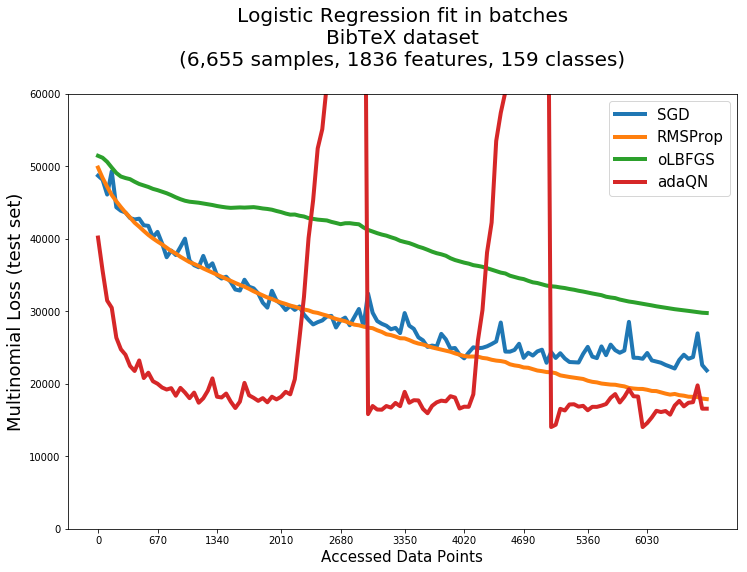

# Stochastic Quasi-Newton Optimization

This package contains implementations of the following stochastic limited-memory quasi-Newton optimizers:
* adaQN (see reference [2])
* SQN (see reference [3])
* oLBFGS (see reference [4])
* Variations of these by e.g. using gradient differences instead of Hessian-vector products or empirical Fisher matrix (see reference [1])

Implementations are in C with a Python interface (R interface to come in the future) and C++ wrapper (with RAII-classes). They are designed in a memory-conscious way so as to avoid unnecessary copying, and introduce parallelization when advantageous.

## Optimizers

Stochastic quasi-Newton methods minimize a differentiable smooth function in expectation by progressively fitting the function/model to batches of sample data, on which expected gradients and other values are calculated. They converge with fewer updates/batches than simple gradient descent or other first-order optimization techniques such as AdaGrad, at the expense of extra memory requirements and extra calculations per batch.

In streaming or online optimization scenarios, they achieve better optima at the same amount of data passed through, making better use of the observations that are given.

The methods are based on the L-BFGS algorithm, but are adapted to the stochastic scenario as follows:
* oLBFGS : creates a correction pair at every iteration, using gradient differences.
* SQN : creates a correction pair every few iterations (this is a model parameter), which is calculated by evaluating Hessian-vector products (can also use gradient differences instead) on average values since last updates, but on a larger batch of data.
* adaQN : also creates correction pairs every few iterations, but in addition uses a non-diagonal inverse-Hessian initialization (can use either AdaGrad or RMSProp), checks that the function value on the averages during updates did not increase (can be skipped), and instead of Hessian-vector products it uses an empirical Fisher matrix for correction pairs creation (can also use gradient differences instead).

oLBFGS and SQN are better suited for convex functions such as logistic loss (Bernoulli likelihood), while adaQN works fine with non-convex functions too (such as neural networks).

Note that, although the methods are meant for stochastic functions, the optimization routines themselves are deterministic, with the only source of randomness being the selection of data batches.

The calculations required by each method are as follows:
```
oLBFGS:
	========== loop ===========
	* calc_grad
	* calc_grad_same_batch		(might skip if using check_nan)
	===========================

SQN:
	========== loop ===========
	* calc_grad
		... (repeat calc_grad)
	if 'use_grad_diff':
		* calc_grad_big_batch
	else:
		* calc_hess_vec
	===========================

adaQN:
	========== loop ===========
	* calc_grad
		... (repeat calc_grad)
	if max_incr > 0:
		* calc_fun_val_batch
	if 'use_grad_diff':
		* calc_grad_big_batch	(skipped if below max_incr)
	===========================
```

Comparison to first-order methods in BibTeX dataset (Logistic Regression with multinomial loss):



## Installation

* Python:
```pip install stochqn```

In case the following error is encountered in Windows systems:
```
ValueError: underlying buffer has been detached
Exception ignored in: <_io.TextIOWrapper mode='w' encoding='cp1252'>
ValueError: underlying buffer has been detached
```
It can also be installed like this:
```
git clone https://www.github.com/david-cortes/stochQN.git
cd stochQN
python setup.py install
```

* C and C++:
```
git clone https://www.github.com/david-cortes/stochQN.git
cd stochQN
mkdir build
cd build
cmake ..
make

### for a system-wide install in linux
sudo make install
sudo ldconfig
```
Linkage is then done with `-lstochqn` (note that both the C and C++ version use the same `.h` header, and the C++ classes are just a wrapper over the C objects and functions, which are conditionally defined in the header).

## Usage

Optimizers can be used in three ways:
1. (Python) As a scikit-learn-like API in which you supply a starting point `x0`, gradient evaluation function and other functions as required (objective function and/or Hessian-vector function, depending on the optimizer and parameters used), which are then fit to data (X, y, sample_weights) passed in methods `fit` and/or `partial_fit`.
2. (Python) As a Tensorflow external optimizer.
3. (Python, C, C++) As a free-mode optimizer that is only interacted with by running a function (method in Python and C++) that modifies the variables in-place and returns a request with the next calculation required by the optimizer (gradient in next batch, gradient in same batch, objective in validation set, Hessian-vector in large batch, gradient in large batch), along with the variable values on which to calculate them, the results of which are then supplied to the optimizer and the optimization function run again, repeating until convergence.

Also included is a logistic regression module (`StochasticLogisticRegression`) with the same API as scikit-learn's.

Mode 1:
```python
import numpy as np
from stochqn import oLBFGS
from sklearn.linear_model.logistic import _logistic_loss_and_grad
from sklearn.datasets import load_digits

def obj_fun(w, X, y, sample_weight=None, reg_param=1.0):
	return _logistic_loss_and_grad(w, X, y, reg_param, sample_weight)[0]
def grad_fun(w, X, y, sample_weight=None, reg_param=1.0):
	return _logistic_loss_and_grad(w, X, y, reg_param, sample_weight)[1]
def pred_fun(w, X):
	return 1 / (1 + np.exp(-X.dot(w[:X.shape[1]]) - w[-1]))

digits = load_digits()
X = digits["data"]
y = (digits["target"] == 3).astype('int64') ### picked one class at random

np.random.seed(1)
w0 = np.random.normal(size = X.shape[1] + 1)

optimizer = oLBFGS(x0=w0, grad_fun=grad_fun, obj_fun=obj_fun, pred_fun=pred_fun, step_size=1e-5)
optimizer.fit(X, y, sample_weight=None, additional_kwargs={"reg_param" : 1.0})
optimizer.partial_fit(X[:100], y[:100], sample_weight=None, additional_kwargs={"reg_param" : 1.0})
optimizer.predict(X)
```
Mode 2:
```python
import numpy as np, tensorflow as tf
from stochqn.tf import TensorflowStochQNOptimizer
from sklearn.datasets import load_digits

digits = load_digits()
X = digits["data"]
y = (digits["target"] == 3).astype('int64') ### picked one class at random

np.random.seed(1)
w0 = np.random.normal(size=(X.shape[1], 1))

### logistic regression - note that there are better ways of doing it in tensorflow
tf.reset_default_graph()
weights = tf.Variable(w0, name='weights')
input_X = tf.placeholder('float64', name='inpX')
input_y = tf.placeholder('float64', name='inpY')
predicted_y = tf.clip_by_value(1 / (1 + tf.exp(-tf.matmul(input_X, weights))), 1e-7, 1 - 1e-7)
loss = -tf.reduce_sum(input_y * tf.log(predicted_y) + (1 - input_y) * tf.log(1 - predicted_y))
loss += tf.reduce_sum(weights ** 2)

optimizer = TensorflowStochQNOptimizer(loss, optimizer='oLBFGS', step_size=1e-1)
model = tf.global_variables_initializer()
sess = tf.Session()
sess.run(model)
with sess:
	for i in range(20):
		optimizer.minimize(sess, feed_dict={input_X:X[i*85 : (i+1)*85], input_y:y[i*85 : (i+1)*85]})
	wopt = weights.eval(session=sess)
```
Mode 3:
```python
import numpy as np
from stochqn import oLBFGS_free
from sklearn.linear_model.logistic import _logistic_loss_and_grad
from sklearn.datasets import load_digits

def obj_fun(w, X, y, sample_weight=None, reg_param=1.0):
	return _logistic_loss_and_grad(w, X, y, reg_param, sample_weight)[0]
def grad_fun(w, X, y, sample_weight=None, reg_param=1.0):
	return _logistic_loss_and_grad(w, X, y, reg_param, sample_weight)[1]

digits = load_digits()
X = digits["data"]
y = (digits["target"] == 3).astype('int64') ### picked one class at random

np.random.seed(1)
w0 = np.random.normal(size = X.shape[1] + 1)

optimizer = oLBFGS_free()
req = optimizer.run_optimizer(x=w0, step_size=1e-5) ### on first run, it will not take a step
for i in range(20):
	while True:
		X_batch = X[i*85 : (i+1)*85]
		y_batch = y[i*85 : (i+1)*85]
		if req["task"] == "calc_grad":
			grad = grad_fun(w0, X, y, reg_param=1.0)
			optimizer.update_gradient(grad)
		elif req["task"] == "calc_grad_same_batch":
			grad = grad_fun(w0, X, y, reg_param=1.0)
			optimizer.update_gradient(grad)

		req = optimizer.run_optimizer(x=w0, step_size=1e-5)
		if req["task"] == "calc_grad":
			break
```


For a longer example see the [IPython example notebook](https://www.github.com/david-cortes/stochQN/blob/master/example/example_stochqn.ipynb) or the C example file [c_rosen.c](https://www.github.com/david-cortes/stochQN/blob/master/example/c_rosen.c).

For usage in C see file [c_rosen.c](https://www.github.com/david-cortes/stochQN/blob/master/example/c_rosen.c). For usage in C++ see [cpp_rosen.cpp](https://www.github.com/david-cortes/stochQN/blob/master/example/cpp_rosen.cpp).

## Documentation

Python documentation is available at [ReadTheDocs](https://stochqn.readthedocs.io/en/latest/), but unfortunately, not everything there is documented - missing parts such as class constructors are still available as docstring (e.g. you can try `help(stochqn.adaQN)`).

C/C++ documentation is available in the header file [include/stochqn.h](https://www.github.com/david-cortes/stochQN/blob/master/include/stochqn.h).

## Known issues

In Python, when using parameter `shuffle_data = True`, oftentimes the results are not reproducible between the first run and further runs (from the second onwards they are reproducible though), despite using the same random seed. So far the only fix seems to be to use `shuffle_data = False` (can also be avoided by manually removing the code that sets the random seeds).

## Serializing (pickling) objects in Python

Use `dill` instead of `pickle` to serialize objects from this package. `dill` has the exact same syntax as `pickle`, but is able to serialize more types of data and less prone to errors.

## References
[1] Wright, S. and Nocedal, J., 1999. "Numerical optimization." (ch 7) Springer Science, 35(67-68), p.7.

[2] Keskar, N.S. and Berahas, A.S., 2016, September. "adaQN: An Adaptive Quasi-Newton Algorithm for Training RNNs." In Joint European Conference on Machine Learning and Knowledge Discovery in Databases (pp. 1-16). Springer, Cham.

[3] Byrd, R.H., Hansen, S.L., Nocedal, J. and Singer, Y., 2016. "A stochastic quasi-Newton method for large-scale optimization." SIAM Journal on Optimization, 26(2), pp.1008-1031.

[4] Schraudolph, N.N., Yu, J. and Günter, S., 2007, March. "A stochastic quasi-Newton method for online convex optimization." In Artificial Intelligence and Statistics (pp. 436-443).
